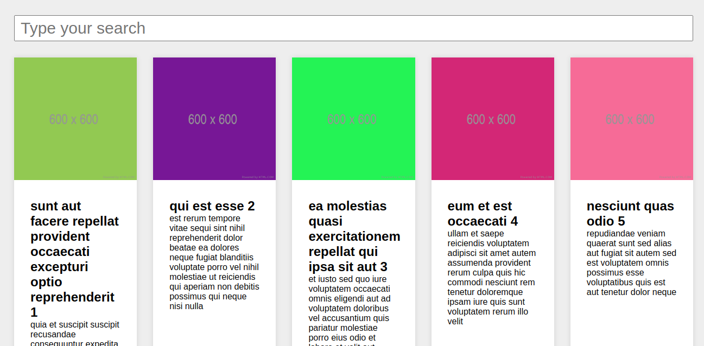

# React project 1




> Os posts são carregados, podendo ser pesquisado pelo seu nome ou sendo acrescentados ao apertar o botão "load more posts".

### Ajustes e melhorias

O projeto ainda está "concluido" faltando apenas as seguintes tarefas:

- [] Testar 100%

## 🚀 Instalando React_project_1

```bash
# Clone este repositório
$ git clone <https://github.com/RafaelTomas/React-project-1.git>

# Acesse a pasta do projeto no terminal
$ cd React-project-1

# Instale as dependências
$ npm install

```

#

## ☕ Usando React project 1

Quando estiver na pasta do projeto, para usar use os seguintes comando:

```
 $ npm run start
```

Para rodar os testes:

```
$ npm run test
```

## 🤝 Autor

<table>
  <tr>
    <td align="center">
      <a href="#">
        <br>
        <sub>
          <b>Rafael Tomás</b>
        </sub>
      </a>
    </td>
  </tr>
</table>

[⬆ Voltar ao topo](#React-project-1)<br>
